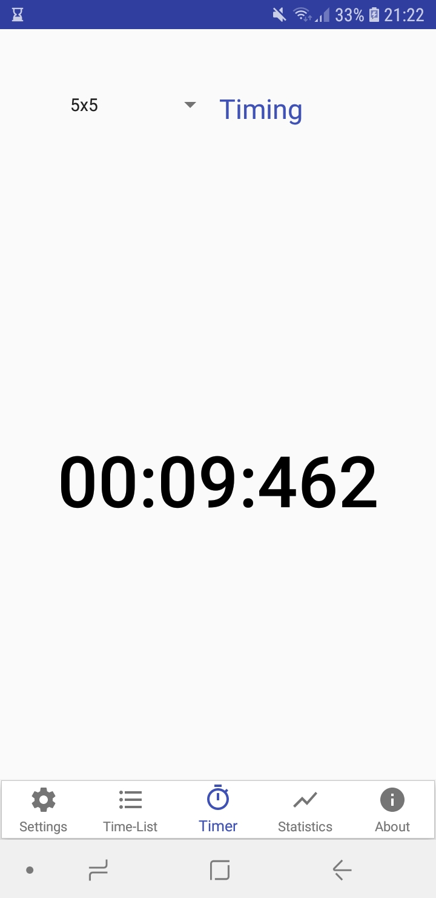
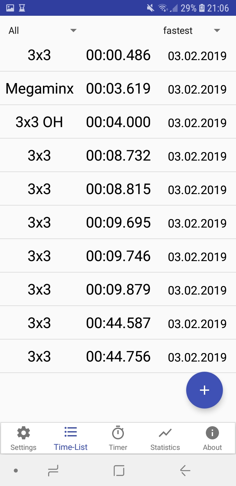
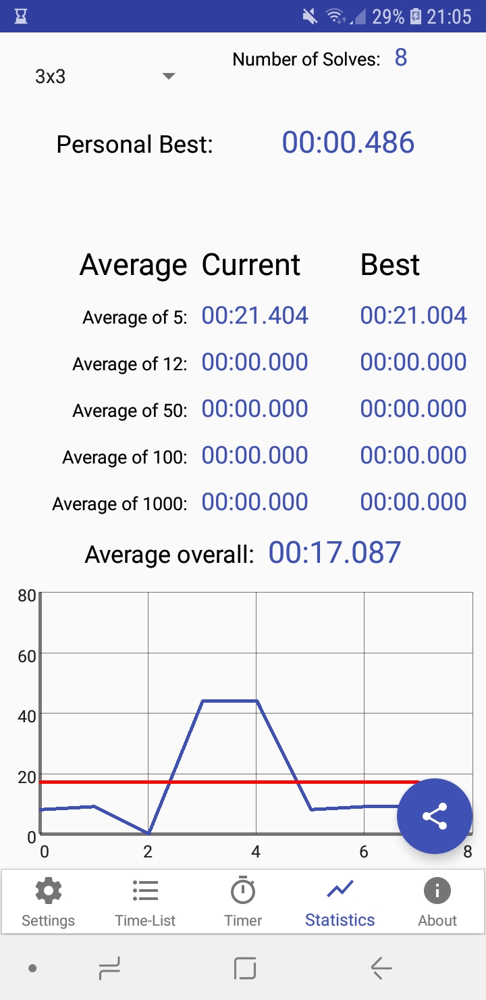

# SpeedCubingTimer 1.0
##### Time your Speedsolves and manage your times!
Android App by a Speedcuber for Speedcubers! This App is in beta for now, with minor bugs and improvements to come but the application is fully functional already.

**To install the App just download the .apk file and execute it on your android phone.**

  

Features are:

- Time solves of all WCA-puzzles
- Add, delete and share times
- View, compare and share your statistics for every puzzle
- Generate custom charts for every puzzle
- Hide time while timing, turn on/off inspection time
- Get notification for new personal bests
- Export your times in various formats

Im currently not actively working on this little project, but will hopefully return when I have a more continuus amount of free time. But feel free to contact me with questions, bugs, help or other regarding this little baby of mine ;-)
